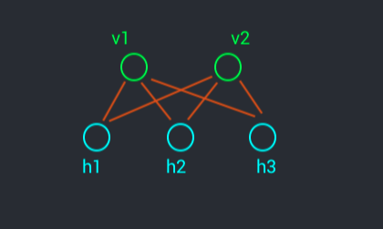

Generative Models
=================

## Introduction

- $x_i$ random variable $\in \{0,1\}$
  - Discrete r.v.
- $X = (x_i, ..., x_p) \in \{0,1\}^p$
  - Multidimensional
- $f : \reals^p \rarr \reals$
------
- $\mathbb{E} (f(x)) = \sum_{x_i, ..., x_p} f(x_i, ..., x_p) \; p(x_i, ..., x_p)$
  - Or on more compact notation:
- $\mathbb{E} (f(x)) = \sum_{X} f(x) \; p(x)$
  - Usually we don't even know the law $p(x)$
  - This is hard! The complexity is in the sum (???)
  - However, we could use some method to approximate this expected value
------
- $s: x^{(i)} \rarr\text{i.i.d}\rarr p(x)$
- $\frac{1}{n} \sum_{i=1}^{n} f(x^{(i)}) \rarr\text{p.s. (presque sûrement)}\rarr_{n\rarr\infin} \mathbb{E}(f(x))$
  - L.G.N. - loi *forte* des grands nombres
- We want to find out $x^{(i)}$


How to transform a uniform law in wathever distribution we want?

## [Gibbs sampler algorithm](https://en.wikipedia.org/wiki/Gibbs_sampling)

- Hypothesis: We know the probability of each sample conditionally to the samples that come before and after it: $p(x_i | x_i, ..., x_{i-1}, x_{i+1}, ..., x_{p}) \; \forall{i}$

- Initialize: $x^{(0)} \sim \prod^{p}_{i=1} \text{where} q(x_i) = \text{Bernoulli}(\frac{1}{2})$
  - We sample a $x_0$ following a law of our choice
------
- For $p:1:L$
  - $x^{(l)} \sim p(x_i | x_i ... x_{i-1}, x_{i+1} ... x_{p})$


Complexity: p * L

### Theorem
$$ \frac{1}{L} \sum^{L}_{p=0} f(x^{p}) \rarr\text{p.s. (presque sûrement)}\rarr_{n\rarr\infin} \mathbb{E}(f(x))$$
- As $n\rarr\infin$, we tend to the expected value $\mathbb{E}$ (esperance)

------

# Restricted Boltzmann Machines (R.B.M.)

- In generative models, we want to learn the distribution of the real data
- We assume that real data follows a distribution
  - However, we'll never know this distribution analitically

- Latent variables
- The joint distribution between latent and observed variables is simple
- How to go from joint distribution to the law of the observations
  - Go from $p(x,y)$ to $p(x)$
- Discrete law multiplied by a conditional
- Wathever is the model we want to work with:
  - We have a simple joint distribution law
    - For ex a Markov Chain
  - We marginalize over the observed, and the remaining complicated law is an approximation of the original data

-------

$$ V = (v_1, ..., v_p), v_i \in \{0,1\} $$
- *e.g.: Binary encoding over the movies a user has seen*

$$ H = (H_1, ..., H_q), H_j \in \{0,1\} $$
- *e.g.: Kind of represents a class ? For example, sci-fi fans*

Chose a simple $p(v,h)$

- Energy model:

$$ p_{\theta}(v,h) = \frac{\exp(-\mathbf{E}(v,h))}{Z} $$

with

$$ \mathbf{E}(v,h) = -\sum_{i=1}^p a_i . v_i - \sum_{j=1}^q b_j . h_j - \sum_{i,j} w_{ij} . v_i . h_j  $$

and

$$ Z = \sum_{v_i, h_j} \exp(-\mathbf{E}(v,h)) $$

- Model depends on parameter $\theta : (a_i, b_j, w_{ij})_{i=1,...,p\; j=1,...,q}$


-----
> It can be shown that:
> $$   p(j|x)  \text{ and } p(x|j) \iff p(x,j) $$
> - If we have both conditional laws on a pair of variables, we have the joint law
-----

Latent, given the observation

$$ p(h|v) = \frac{p(h,v)}{p(v)} $$

$$ = \frac{p(v,h)}{\sum^{h} p(v,h) } $$

$$ = \frac{ \exp(-\mathbf{E}(v,h)) }{\sum^{h} \exp(-\mathbf{E}(v,h)) } $$

> exponentielle des sommes = produit des exponnentielles

> Sum of products is the product of sums
> $$ \sum_{h_1,...,h_q} g(h_1)...g(h_q) = \sum_{h_1} g(h_1)...\sum_{h_q} g(h_q)$$
 

> ⚠️ **The derivation is not complete**

<!-- $$
= \frac{
  ( \prod_{i} \exp(a_i v_i) ) \; (\prod_{j} \exp(b_j k_j) + \sum_{i} w_{ij} v_i h_j)   
}{
  ( \prod_{i} \exp(a_i v_i) ) \; (\prod_{j} \exp(b_j k_j) + \sum_{i} w_{ij} v_i h_j)   
}
$$ -->

$$ ... $$

$$ \therefore \; p(h|v) = \prod_{j=1}^{q} g(h_j)$$
As seen above, the law $p(v,h)$ can be written as a product: conditionally to $v, w$ and $h$ are independent 

With

$$ g(h_j = 1) = \frac{1}{1 + \exp(- (b_j + \sum^{p}_{i=1} w_{ij} v_{i}))} = \text{sigm}(b_j + \sum^{p}_{i=1} w_{ij} v_{i}) $$

> **Perceptron !!!**
 
$$ g(h_j = 0) = 1 - g(h_j = 1) $$


### Conclusion

$$ \therefore \; p(h|v) = \prod^{q}_{j=1} p_\theta(h_j | v) $$
with
$$ p(h_j = 1 | v) = \text{sigm}(b_j + \sum^{p}_{i=1} w_{ij} v_{i}) $$


<!-- even not knowing $p(v,h)$, I have $p(h|v)$ -->

### And the other way around?


$$ p_\theta(v|h) = \prod_{i=1}^{p} p_\theta(v_i | h)$$

with

$$ p_\theta(v_i = 1 | h) = \text{sigm}(b_j + \sum^{p}_{i=1} w_{ij} v_{i}) $$


### Visualizing



- The films aren't independent among them - if they were, there would be no point in what we are doing.

- However, when I know $h$, the $v$ are independent (when we eliminate all $h$ nodes, the $v$ nodes aren't connected)

- Stochastic NN with only one layer
  - Neurons are actually variables

- From the NN generality theorem:
  - In theory, we can estimate whichever probability distribution law

> ⚠️: <br>
> $$ \text{Missing derivarion using the Kullback–Leibler divergence (KLD)} $$

> **When using Generative models**
> - Generative power of the model
>   - Can the model architecture, theoretically, model the data?
> - Estimate the model's parameters, using the data
> - How to use it in practice
>   - How to choose the latent variables
>   - How to generate samples from the model


We have found the two conditional laws, so we can obtain the joint law

------
# Applications

## 1. Data Generation
- Sample from the data distribution, but how to do it if we don't have $p_\theta(v)$?
  - (We have used the data to estimate the parameters $\theta$)

$$ v \sim p_\theta(v) \text{?}$$ 

Since we have both conditional laws:

$$   p(v|h)  \; \text{and} \; p(h|v) \rArr \text{Gibbs} $$

## 2. Dimensionality Reduction

$$ q << p $$

## 3. Use $h$ associated to $v$ for a supervised estimation algorithm


------

# Training the model (estimate $\theta$)


- $x$ is now the user's taste
  - Each user's taste is assumed to be independent $x^{(k)} \; \text{i.i.d.}$
  - $x$ is the realization of $v$

$$ x^{(1)}, ..., x^{(n)}, \text{with} \; x^{(k)} \in \{0,1\}^{p} $$

The log-likelihood will be the sum of the log of the likelihoods on each of the $x$

> Likelihood is the law of what we observe


> We want to find $\theta$ as the argmax of the (log-)likelihood <br>
> If on VAE, it's the marginal of the joint law - but we can't integrate it to marginalize. <br>
> We then use the ELBO, a lower bound on the likelihood.

For one $x$, we maximize w.r.t. $\theta$:

$$ \log p_\theta(x) = \log \sum_{h} p_\theta(x,h) $$
$$ = \log \sum_{h} p_\theta(x,h) $$

> ---
> From Energy model:
> $$ p_{\theta}(v,h) = \frac{\exp(-\mathbf{E}(v,h))}{Z} $$
>
> So continuing the derivation:
> 
> ---

$$ = \log \sum_{h} \frac{\exp(-\mathbf{E}_{\theta}(x,h))}{Z} $$

Z depends on $\theta$, so we'll keep it
 
$$ = \log \sum_{h} \exp(-\mathbf{E}_{\theta}(x,h)) - \log (Z) $$

$$ = \log \sum_{h} \exp(-\mathbf{E}_{\theta}(x,h)) - \log \left(\sum_{v,h} \exp(-\mathbf{E}_{\theta}(x,h))\right) $$

Here we use $v$ as notation for the sum, we can do it since it's a mute variable. We cannot use $x$ to sum, because $x$ is the data "qui tombe du ciel". $x$ is a "réalisation" of $v$.

In order to make a **gradient ascent**:

$$
  \frac{\partial \log(p_\theta(x))}{\partial w_{ij}} = 
  \frac{\sum_{h} x_i \; h_j \; \exp(-\mathbf{E}_{\theta}(x,h))} {\sum_{h} \exp(-\mathbf{E}_{\theta}(x,h))} -
  \frac{\sum_{v,h} v_i \; h_j \; \exp(-\mathbf{E}_{\theta}(v,h))} {\sum_{v,h} \exp(-\mathbf{E}_{\theta}(v,h))}
$$


$$
= 
  \sum_{h} x_i \; h_j \; p_\theta(h\;|\;v = x)  -
  \sum_{v,h} v_i \; h_j \; p_\theta(v, h)
$$


> **Marginalization** <br>
> $$ \sum_{x,z} p(x,y,z) = p(y) $$
> So:
> $$
> \sum_{h} ....
> Details
> $$


$$
= \sum_{h_j} x_i \; h_j \; p_\theta(h_j\;|\;v = x)  -
  \sum_{v,h_j} h_j  \; v_i \; p_\theta(v, h_j)
$$

$$ = x_i \; p_\theta(h_j=1 | x) - \sum_{v} v_i \; p(h_j=1|v) \; p(v) $$


With  $f_{i,j}(v) = v_i \; p(h_j=1|v)$:
$$ = x_i \; p_\theta(h_j=1 | x) - \sum_{v} f_{i,j}(v) \; p(v) $$

$$ = x_i \; p_\theta(h_j=1 | x) - \mathbb{E} \left(f_{i,j}(v) \; p(v) \right)$$


$p(h=1 | x)$ is what we know how to obtain


> To obtain the subtracting term, Gibbs will work. However, doing a Gibbs sampling for each data point (our batch) will take too long - we want to initialize Gibbs in order to do only one iteration.

### Gibbs

$$ v^{(0)} = x$$
$$ h^{(0)} \sim p_\theta(h|v^{(0)}) = \prod_j p_\theta(h_j|v^{(0)})$$
$$ v^{(1)} \sim p_\theta(v|h^{(0)}) = \prod_i p_\theta(v_i|h^{(0)})$$


-----
$$
\rArr \frac{\partial \log p_{\theta}(x)}{\partial w_{ij}} 
\approx
x_i \; p_{\theta}(h_j=1 | x) - f_{i,j}(v^{(1)})
$$
-----
$$
\frac{\partial \log p_{\theta}(x)}{\partial a_{i}} 
\approx
x_i \; p_{\theta}(h_j=1 | x) - v^{(1)}_i p_{\theta}(h_j=1 | v^{(1)})
$$

$$ =  $$

..........

> $v^{(1)}_i$ is the reconstruction of the data $x_i$

- How to know if the model has learned?
  - Gradient is small, and the reconstruction is close to the initial data

## CD-1 Algorithm

For one data $x$

- Current $\theta$
- $v^{(0)} = x$
- $h^{(0)} \sim p_\theta(h|x)$
- $v^{(1)} \sim p_\theta(v|h)$
> Parameters: One matrix of weights and two vectors of biases
- $\forall i,j$:
  - $\text{grad\_}w_{ij} = x_i p_\theta(h_j=1|x) - v^{(1)}_i p_\theta(h_j=1|v^{(1)})$
  - $\text{grad\_}a_{i} = x_i - v^{(1)}_i$
  - $\text{grad\_}b_{j} = p_\theta(h_j=1|x) - p_\theta(h_j=1|v^{(1)})$
  - $w_{ij} \leftarrow w_{ij} + \epsilon.\text{grad\_}w_{ij}$
  - $a_{i} \leftarrow a_{i} + \epsilon.\text{grad\_}a_{i}$
  - $b_{j} \leftarrow b_{j} + \epsilon.\text{grad\_}b_{j}$

## Write pseudocode
<!-- ```python
v0 = x
h0 
``` -->


- For each character, 39 samples
- q is hyperparameter

```python


def init_RBM(p,q)

def in_out (X)
# Inputs X of size n x p
# Outputs n x q

def out_in (H)
# Inputs H of size n x q
# Outputs n x p

def train(X, size_batch, eps, epoch)

```
